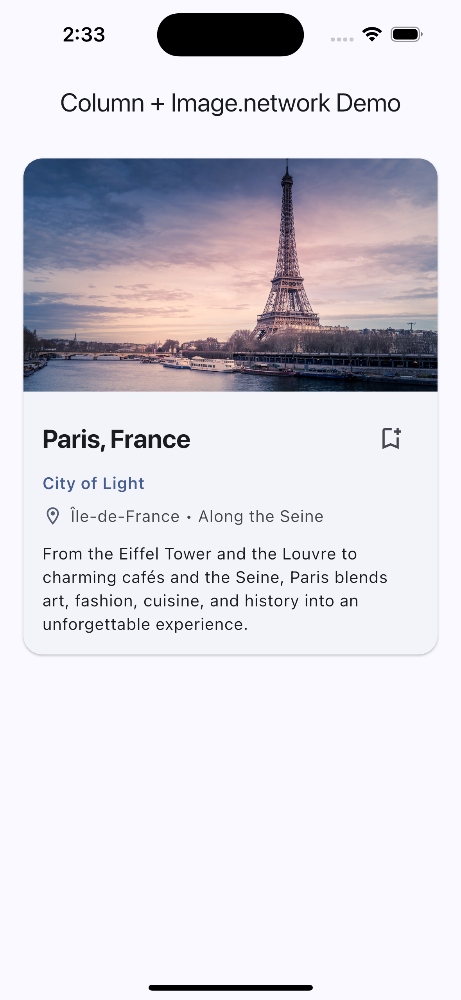

## Focus: Column and Image.network (attributes used)

This demo highlights two core Flutter widgets — `Column` and `Image.network` — and how their attributes are used in `lib/main.dart` to build a travel card UI.

### Column (attributes used)

1) `crossAxisAlignment`
- Controls horizontal alignment of children within the column.
- Used as `CrossAxisAlignment.stretch` to make children expand horizontally (e.g., on the home page layout) and `CrossAxisAlignment.start` to left-align content inside the card body.

```dart
Column(
  crossAxisAlignment: CrossAxisAlignment.stretch,
  children: <Widget>[
    TravelCard(...),
  ],
)

// Inside TravelCard body
Column(
  crossAxisAlignment: CrossAxisAlignment.start,
  children: <Widget>[
    // title, subtitle, location row, description
  ],
)
```

2) `children`
- The ordered list of widgets arranged vertically. This is how the card composes text, icons, and spacing in a readable structure.

3) (Implicit) `mainAxisAlignment`
- Not explicitly set in this demo (defaults to `MainAxisAlignment.start`). Children stack from top to bottom without extra spacing.

### Image.network (attributes used)

1) `fit`
- Specifies how the image should be inscribed into its box. Used as `BoxFit.cover` so the header image fills the 16:9 frame while cropping as needed.

2) `loadingBuilder`
- Callback invoked while the image is loading. Used to display a pulsing skeleton placeholder until the network image is ready.

```dart
Image.network(
  imageUrl,
  fit: BoxFit.cover,
  loadingBuilder: (
    BuildContext context,
    Widget child,
    ImageChunkEvent? loadingProgress,
  ) {
    if (loadingProgress == null) return child;
    return _SkeletonLoader(color: scheme.surfaceContainerHighest.withValues(alpha: 0.6));
  },
)
```

3) (Positional) `src` URL
- The first positional parameter is the image URL string. It points to a direct image resource used as the card header.

Notes:
- The image is wrapped in an `AspectRatio`(16:9) to keep a consistent header shape.
- A `Semantics(label: ...)` wrapper provides an accessible description for screen readers.


### Screenshot




